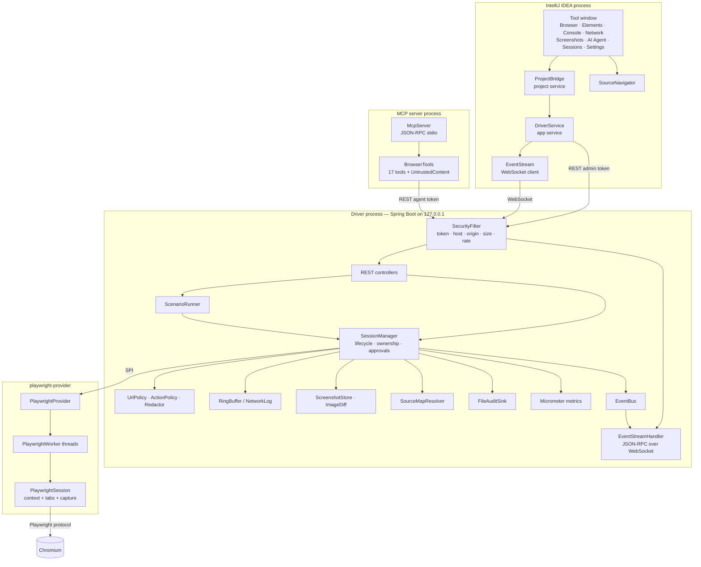
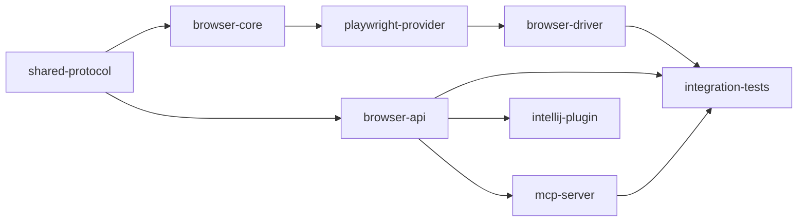

# Component Diagram

```mermaid
flowchart TB
    subgraph IDE[IntelliJ IDEA process]
        TW[Tool window<br/>Browser · Elements · Console · Network<br/>Screenshots · AI Agent · Sessions · Settings]
        PB[ProjectBridge<br/>project service]
        DS[DriverService<br/>app service]
        ES[EventStream<br/>WebSocket client]
        SN[SourceNavigator]
        TW --> PB --> DS
        DS --> ES
        TW --> SN
    end

    subgraph MCPP[MCP server process]
        MS[McpServer<br/>JSON-RPC stdio]
        BT[BrowserTools<br/>17 tools + UntrustedContent]
        MS --> BT
    end

    subgraph DRV[Driver process — Spring Boot on 127.0.0.1]
        SF[SecurityFilter<br/>token · host · origin · size · rate]
        RC[REST controllers]
        WS[EventStreamHandler<br/>JSON-RPC over WebSocket]
        SM[SessionManager<br/>lifecycle · ownership · approvals]
        POL[UrlPolicy · ActionPolicy · Redactor]
        BUF[RingBuffer / NetworkLog]
        SR[ScenarioRunner]
        SS[ScreenshotStore · ImageDiff]
        SMR[SourceMapResolver]
        AUD[FileAuditSink]
        MET[Micrometer metrics]
        BUS[EventBus]
        SF --> RC & WS
        RC --> SM
        RC --> SR --> SM
        SM --> POL & BUF & SS & SMR & AUD & MET
        SM --> BUS --> WS
    end

    subgraph PWP[playwright-provider]
        PP[PlaywrightProvider]
        PWK[PlaywrightWorker threads]
        PS[PlaywrightSession<br/>context + tabs + capture]
        PP --> PWK --> PS
    end

    DS -- REST admin token --> SF
    ES -- WebSocket --> SF
    BT -- REST agent token --> SF
    SM -- SPI --> PP
    PS -- Playwright protocol --> CH[(Chromium)]
```

Module dependencies:

```mermaid
flowchart LR
    shared-protocol --> browser-core --> playwright-provider --> browser-driver
    shared-protocol --> browser-api --> mcp-server
    browser-api --> intellij-plugin
    browser-driver & browser-api & mcp-server --> integration-tests
```
